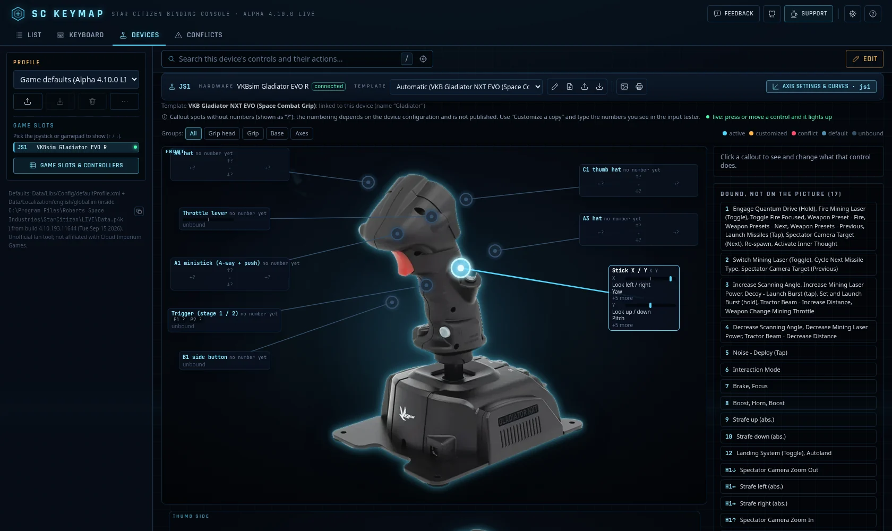
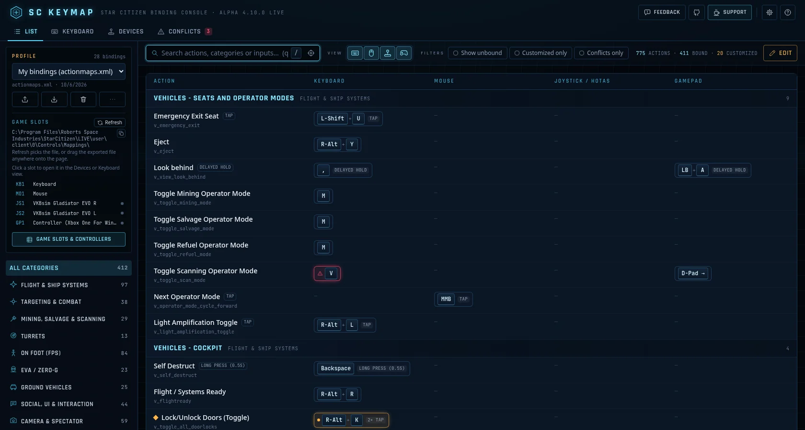

<div align="center">

# SC Keymap

**Browse, search, edit and export your Star Citizen keybindings, with a picture of your own HOTAS.**

[](https://sc-mapper.vercel.app)

[](LICENSE)
[](https://github.com/hamlet2k/sc-mapper/issues/new)
[](https://ko-fi.com/hamlet2k)

</div>

SC Keymap is a client-only web app. It ships with the game's own default bindings, lays your exported keybinds on top,
lets you rebind anything by pressing it on your keyboard, mouse, gamepad or joystick, and exports a file that Star Citizen
loads. Everything runs in your browser: your files are never uploaded.





## Features

**Four views**
- **List**: every action by category and action map, with instant search, input-type toggles (keyboard / mouse /
  joystick / gamepad) and filters (show unbound, customized only, conflicts only). Customized bindings are marked amber.
- **Keyboard**: a heat map of the keyboard and mouse, with a modifier selector and an input inspector that can rebind
  the selected key.
- **Devices**: a picture of each joystick or gamepad with a callout per control (buttons, hats, axes with their live
  value) and the actions bound to it. Callouts light up while you press the control. Save it as PNG or print it.
- **Conflicts**: the same physical input on different actions that are live in overlapping contexts with clashing
  activation modes. By default only overlaps involving your own changes; default-vs-default overlaps on request.

**Editing**
- **Live capture** of keyboard keys (with left / right modifiers), mouse buttons, wheel and axes, gamepad buttons, sticks
  and triggers, and joystick / HOTAS buttons, axes and hats. A manual entry field covers anything the browser can't capture.
- Activation modes and multi-tap per binding, a conflict check on every capture (Replace / Keep both / Listen again),
  undo (Ctrl+Z), reset and revert to the imported file. An **Edit** toggle on every view.
- **Search** that understands inputs: `quantum`, `qntm` (fuzzy), `lalt+n`, `key:f`, `mouse2` / `rmb`, `js2 btn5`,
  `js1_button5`. **Find by pressing**: press a button, hat, axis or key and the view narrows to that exact input.
- **Highlight on press**: press any input and its bindings flash in the current view.
- **Axis settings & curves** per joystick (js1–js8) and gamepad (gp1): invert, exponent, custom response curve with
  draggable points, per-axis deadzone and saturation, with a live chart. Read from and written back to your file.

**Devices and templates**
- **Built-in device templates** with cut-out product photos and callouts for popular sticks, throttles, pedals and panels
  (see [Supported hardware](#supported-hardware)), picked automatically by USB id or device name. Multi-page templates
  show several photos of one device (e.g. the panel and each grip).
- **Template editor**: *Customize a copy* of any template or start a new one. Upload a photo or render of your device,
  place callouts by clicking or with **Press to place** (press each control), group them, and add up to 12 pages.
  Uploaded pictures can have their background removed in the browser (U²-Net, nothing uploaded) and be framed like
  the built-in photos.
- Templates **export and import as JSON** with the picture embedded, so you can share them.
- **Game slots & controllers**: which hardware is js1, js2, gp1… and which template each one uses. Pick hardware by
  pressing one of its buttons, move mappings between slots, and copy bindings from one slot to another.
- **Input tester**: every connected controller's buttons and axes live, with the Star Citizen input each one maps to.
- **Refresh game state**: when the game renumbers your devices (after unplugging something, for example), drop a fresh
  export onto the page. The app compares the device lists, shows the moves (e.g. *Pedals js3 → js5*) and shifts your
  bindings, hardware, templates and axis settings in one undoable step.

**Files**
- **Import** `actionmaps.xml` or an exported `layout_*_exported.xml` by drag and drop or the file picker. Keep several
  profiles side by side (stored in your browser's `localStorage`).
- **Export** a `layout_<name>_exported.xml` for the game's *Control Profiles* or a full `actionmaps.xml`. Only the
  bindings that differ from the defaults are written, and device options from your file (curves, inverts, deadzones) are kept.
- **Settings → Star Citizen folder**: set your install folder and channel (LIVE / PTU / EPTU / TECH-PREVIEW) and every
  path the app shows follows it, with a copy button.

Default bindings come from the game's own `defaultProfile.xml`, currently **Star Citizen Alpha 4.10.0 LIVE**
(build 4.10.193.11644).

## Supported hardware

Any keyboard, mouse, gamepad or joystick the browser can see works for capture and binding. Devices without a
built-in template use the generic drawings below, or a template you make yourself.

**Generic templates** (original wireframe drawings): stick (grip + base), throttle (twin levers + control panel),
gamepad (modern dual-stick layout).

**Device templates with photos:**

| Brand | Templates |
| --- | --- |
| Thrustmaster | HOTAS Warthog stick · HOTAS Warthog throttle · T.16000M FCS stick · TWCS throttle · T.Flight Rudder Pedals (TFRP) · Pendular Rudder (TPR) |
| VIRPIL | Alpha Prime (R) stick · VMAX Prime throttle · R1-FALCON Rudder Pedals |
| VKB | Gladiator NXT EVO (Space Combat Grip) · Gunfighter + MCG Ultimate · STECS Mk.II + STEM module · T-Rudder Mk.V |
| WinCtrl | CarrierAce stick · ViperAce stick · Orion throttle (F-15EX grips, F/A-18 panel) · URSA MINOR throttle (Combat grip) · Orion Combat Rudder Pedals · CarrierAce MFD · CarrierAce PTO 2 · CarrierAce UFC + HUD |
| MOZA | AB6 base + MHG grip, with grip variants for MH16, WinCtrl CarrierAce and WinCtrl ViperAce EX · MTP throttle · MTQ throttle quadrant (Combat, Airbus and Boeing grips) |
| Logitech | G X56 stick · G X56 throttle · G Flight Rudder Pedals (Saitek Pro Flight) |
| Honeycomb | Bravo Throttle Quadrant · Charlie Rudder Pedals |
| MFG | Crosswind V3 Rudder Pedals |
| Azeron | Keypad (photo only: add your own callouts with *Customize a copy*) |

Is your device missing or numbered differently? [Open an issue](https://github.com/hamlet2k/sc-mapper/issues/new), or
export your own template as JSON and attach it.

## How to use

1. **Export your bindings from Star Citizen.** In game: *Options → Keybindings → Advanced Controls Customization →
   Control Profiles → Save Control Settings*. The file lands in
   `<game folder>\LIVE\user\client\0\Controls\Mappings\layout_<name>_exported.xml`. You can also use your live
   `…\LIVE\user\client\0\Profiles\default\actionmaps.xml`.
2. **Import it.** Open [sc-mapper.vercel.app](https://sc-mapper.vercel.app) and drop the file onto the page (or use
   *Import* in the profile panel).
3. **Check your devices.** Open *Game slots & controllers* to confirm which controller is js1, js2… and which template it
   uses. Press a button on each controller so the browser shows it.
4. **Edit.** Turn on *Edit*, click a binding, press the new input. Use the Conflicts view to clean up clashes.
5. **Export back.** *Export* writes `layout_<name>_exported.xml`. Copy it into the `Controls\Mappings` folder above and load
   it in game from *Control Profiles*, or in the console with `pp_RebindKeys layout_<name>_exported.xml`.

When the game later renumbers your devices, save a fresh export and drop it onto the page to **refresh game state**.

## Browser notes

- **Firefox is recommended for HOTAS setups.** Chromium-based browsers (Chrome, Edge, Brave, Opera…) only expose the
  **first 4 controllers** and at most **32 buttons and 16 axes** per device. Firefox shows every device and all its
  buttons. The app shows a banner when it detects these limits.
- Browsers hide controllers until you **press a button** on them, so press something first.
- Controllers are read through the browser's Gamepad API, so axis and hat numbering can differ from the game's DirectInput
  order on some devices. Check in game and use manual entry if needed.
- Star Citizen reads up to 128 buttons per device; higher buttons can be captured but likely won't work in game.
- Your profiles live in this browser's storage. To move to another browser, export from one and import in the other.

More detail: [docs/technical-notes.md](docs/technical-notes.md) (data source, file format, value ranges, known limitations).

## Local development

Requires Node.js 20 or newer.

```bash
npm install
npm run dev            # dev server on http://localhost:5173
npm run build          # type-check + production build to dist/
npm run preview        # serve dist/ on http://localhost:4173
npm run lint           # oxlint
npm test               # unit tests + parse/merge/search/conflict self-test on the sample profile
npm run test:unit      # unit tests + background-removal test
npm run test:e2e       # Playwright e2e against a running preview (Chrome; Firefox checks if installed)
npm run test:fixtures  # download pinned real keybinding files and round-trip them
npm run data           # rebuild src/data/defaults.json from data/raw/
npm run data:fetch     # download the pinned game files and rebuild the defaults
```

`dev`, `build` and the test scripts download the pinned game data on first run (see
[docs/technical-notes.md](docs/technical-notes.md#data-source)). The UX decisions behind the app are in
[docs/ux-decisions.md](docs/ux-decisions.md).

## Contributing and feedback

Bug reports, missing devices and ideas are welcome: [open an issue](https://github.com/hamlet2k/sc-mapper/issues/new).
The app also has a **Feedback** button in its header. Pull requests are welcome too; please run `npm run build` and
`npm test` first.

## Support

SC Keymap is free and has no ads or tracking. If it saves you an evening of rebinding, you can
[buy me a coffee on Ko-fi](https://ko-fi.com/hamlet2k).

[](https://ko-fi.com/hamlet2k)

## License

The source code is released under the [MIT License](LICENSE), © 2026 hamlet2k.

Not covered by that license:
- **Product photos** in `public/device-photos/` belong to their respective manufacturers.
- **Star Citizen game data** (default bindings and labels, downloaded at build time) belongs to Cloud Imperium Games.
- **Third-party software and models** (ONNX Runtime Web, the U²-Net-p background-removal model, React and others) keep
  their own licenses.

Details and attributions: [THIRD_PARTY_NOTICES.md](THIRD_PARTY_NOTICES.md).

## Disclaimer

SC Keymap is an unofficial fan project. It is not affiliated with, endorsed by or sponsored by Cloud Imperium Games or
Roberts Space Industries. Star Citizen®, Roberts Space Industries® and Cloud Imperium® are trademarks of Cloud Imperium
Rights LLC. Hardware and product names are trademarks of their respective owners and are used only to identify the devices.
